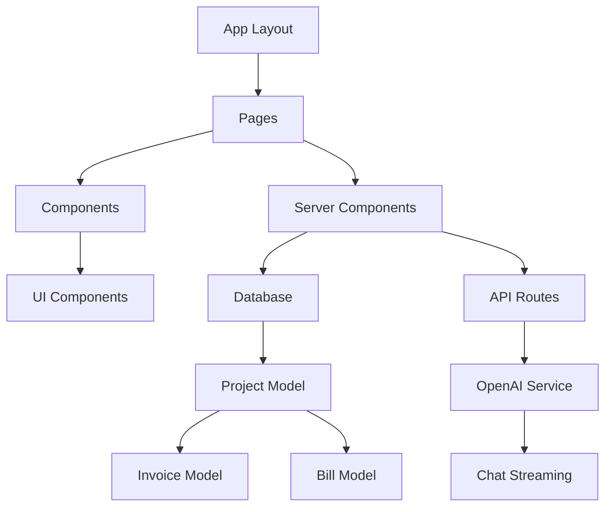

# Financial Management System Architecture

## System Design

### Overview

- Next.js 14 App Router based architecture
- Server-first component approach
- SQLite database with Prisma ORM
- Tailwind CSS for styling
- shadcn/ui component system
- Financial data management system
- OpenAI integration for AI assistance

### Component Relationships



### Data Flow

- Server Components for data fetching
- Prisma for database operations
- Client Components for interactivity
- Server Actions for mutations
- Error boundaries for failure handling
- Financial data validation and processing
- Real-time chat streaming with OpenAI

## Technical Decisions

### Technology Choices

- Framework/Library choices
  - Next.js 14: Modern React framework with App Router
  - Prisma: Type-safe database access with SQLite
  - SQLite: Lightweight, serverless database
  - Tailwind CSS: Utility-first styling
  - shadcn/ui: Accessible component system
  - TypeScript: Type safety and developer experience
  - OpenAI SDK: AI integration with streaming support

### Design Patterns

- Server Components First
  - Use case: Data fetching and rendering
  - Implementation: React Server Components
- Client Components
  - Use case: Interactive UI elements
  - Implementation: "use client" directive
- Database Access
  - Use case: Data persistence
  - Implementation: Prisma Client
- Financial Data Models
  - Projects: Central entity for organization
  - Invoices: Revenue tracking
  - Bills: Expense tracking
- AI Integration
  - Use case: Chat assistance
  - Implementation: Server-Sent Events for streaming
  - Error handling: Graceful degradation
  - State management: Real-time updates

### Performance Considerations

- Server-side rendering for initial load
- Client-side navigation for speed
- Database connection pooling
- Component code splitting
- Image optimization
- Financial calculations optimization
- Streaming responses for AI chat
- Efficient message handling

## Dependencies

### External Services

- Service: SQLite Database
  - Purpose: Data storage
  - Version: Latest
  - Location: Local filesystem
  - Backup strategy: Regular backups
  - Data integrity: ACID compliance

- Service: OpenAI API
  - Purpose: AI chat assistance
  - Version: GPT-4
  - Integration: Server-side API routes
  - Security: Environment variables
  - Rate limiting: Per user/session

### Internal Dependencies

- Module: Prisma Client
  - Purpose: Database access
  - Version: Latest
  - Integration: Server Components
  - Error handling: Try-catch with logging
  - Connection management: Connection pooling

- Module: OpenAI SDK
  - Purpose: AI communication
  - Version: Latest
  - Integration: API routes
  - Streaming: Server-Sent Events
  - Error handling: Graceful degradation

### Configuration

- Environment variables
  - DATABASE_URL
  - NODE_ENV
  - API keys (if needed)
- Feature flags
  - Development features
  - Beta features
- Build settings
  - TypeScript configuration
  - Tailwind configuration
  - Prisma schema

## Security

### Authentication

- Method: TBD
- Implementation: Server-side
- Token handling: HTTP-only cookies
- Session management: Server-side sessions

### Authorization

- Role-based access control
- Server-side validation
- Protected routes
- Resource-level permissions

### Data Protection

- Input validation
- SQL injection prevention via Prisma
- XSS prevention
- CSRF protection
- Financial data encryption

## Monitoring

### Metrics

- Page load times
- API response times
- Database query performance
- Error rates
- Financial transaction metrics

### Logging

- Server-side logs
- Client-side error tracking
- Database query logging
- Performance monitoring
- Transaction audit logs

## Data Models

### Core Entities

1. Project
   - Primary key: cuid()
   - Properties:
     - name: String
     - invoices: One-to-many
     - bills: One-to-many
   - Timestamps: created, updated

2. Invoice
   - Primary key: cuid()
   - Properties:
     - total: Float
     - date: DateTime
     - notes: Optional String
     - projectId: Foreign key
   - Relationships: Belongs to Project
   - Indexes: projectId

3. Bill
   - Primary key: cuid()
   - Properties:
     - total: Float
     - date: DateTime
     - notes: Optional String
     - projectId: Foreign key
   - Relationships: Belongs to Project
   - Indexes: projectId

### Database Schema

```prisma
model Project {
  id        String    @id @default(cuid())
  name      String
  invoices  Invoice[]
  bills     Bill[]
  createdAt DateTime  @default(now())
  updatedAt DateTime  @updatedAt
}

model Invoice {
  id        String   @id @default(cuid())
  total     Float
  date      DateTime
  notes     String?
  project   Project  @relation(fields: [projectId], references: [id])
  projectId String
  createdAt DateTime @default(now())
  updatedAt DateTime @updatedAt
  @@index([projectId])
}

model Bill {
  id        String   @id @default(cuid())
  total     Float
  date      DateTime
  notes     String?
  project   Project  @relation(fields: [projectId], references: [id])
  projectId String
  createdAt DateTime @default(now())
  updatedAt DateTime @updatedAt
  @@index([projectId])
}
```

## Deployment

### Requirements

- Node.js runtime
- SQLite database
- Environment variables
- Build artifacts
- Database backup system

### Process

- Build static assets
- Database migrations
- Environment configuration
- Health check verification
- Database backup verification

## Future Considerations

- Migration to different database if needed
- Authentication implementation
- API rate limiting
- Caching strategy
- Performance optimization
- Financial reporting system
- Data export capabilities
- Multi-currency support 